[README (1).md](https://github.com/user-attachments/files/31383220/README.1.md)
<!-- banner -->

  

## `>_ whoami`

Sou a **Juliana**, desenvolvedora focada em **Python, análise de dados e automação**.
Gosto de pegar planilha bagunçada e transformar em coisa útil — notebooks, dashboards, bots e scripts que rodam sozinhos.
Atualmente estudando e construindo projetos com Pandas, automação de Excel e chatbots com n8n.

<table align="center" border="0">
  <tr>
    <td align="center" valign="middle">
      
    </td>
    <td align="center" valign="middle">
      
    </td>
  </tr>
</table>

## `>_ stack`

  
  
  
  
  
  
   
  
  
  
  
  
  

## `>_ stats`

  

  
  

  

## `>_ contato`

  
  
  

<!-- rodapé -->

